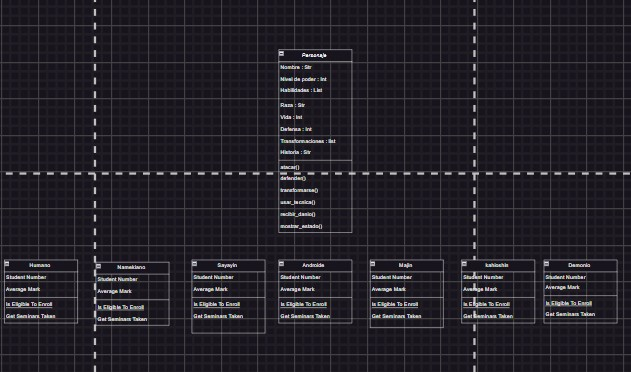

**Universidad Nacional Guillermo Brown**
**Cátedra: Estructuras de Datos en Python**
**II Cuatrimestre 2024**

# Título del Proyecto


## Tabla de Contenidos
- [Introducción](#introducción)
   
    - [Descripción](#descripción)
    - [Objetivos](#objetivos)


- [Planificación](#planificación)

    - [Análisis del mercado](#análisis-del-mercado)
    - [Alcance del proyecto](#alcance-del-proyecto)
    - [Metodología](#metodología)


- [Análisis](#Análisis)

    - [Especificación de requerimientos](#especificación-de-requerimientos)
        
        - [Requerimientos funcionales](#requerimientos-funcionales)
        - [Requerimientos no funcionales](#requerimientos-no-funcionales)
        
    - [Historia de usuarios y criterios de aceptación](#historia-de-usuarios-y-criterios-de-aceptación)


- [Requisitos](#requisitos)
- [Instalación](#instalación)
- [Uso](#uso)
- [Ejemplos](#ejemplos)
- [Gráficos](#gráficos)
- [Contribuciones](#contribuciones)
- [Licencia](#licencia)

## Introducción 


### Descripción
Este proyecto tiene como objetivo [describir brevemente el propósito del proyecto]. Se implementa utilizando [tecnologías utilizadas, por ejemplo, Python, Java, etc.].

### Objetivos
- Objetivo 1: [Descripción del objetivo]
- Objetivo 2: [Descripción del objetivo]
- Objetivo 3: [Descripción del objetivo]


## Planificación

### Análisis del mercado
[analisis-del-mercado]: #analisis-del-mercado


Aquí deben describir brevemente la relevancia del proyecto


### Alcance del proyecto
[alcence-del-proyecto]: #alcance-del-proyecto

 Identificar las funciones principales y límites del proyecto


### Metodología  

Metodología y proceso de trabajo optamos en trabajar con reuniones semanales a disponibilidad de cada uno.
- Meet
- Drive
- Discord
- Repositorio de Github
- Grupo de WhatsApp


## Análisis

### Especificación de requerimientos
[especificación-de-requerimientos]:#especificación-de-requerimientos

#### Requerimientos funcionales
[requerimientos-funcionales]:#requerimientos-funcionales

Detallar los requerimientos funcionales y no funcionales
de la aplicación.

En función al problema y el análisis de los trabajos relacionados, se especifican los siguientes
requerimientos funcionales, mismos que se plantean a continuación:
1. Sistema de combate:
- RF-01: Implementar un sistema de combate estratégico que permita la interacción del
jugador con diferentes habilidades y movimientos.
- RF-02: Desarrollar una variedad de habilidades únicas para cada clase de personaje
ya sea jugable o no, lo que permite la diversificación de estrategias de combate.
- RF-03: Permitir la combinación de habilidades con el propósito de generar combos y
efectos especiales durante los enfrentamientos.

2. Progresión del Personaje:
- RF4: Crear un sistema de niveles y experiencia que permita al jugador avanzar y
mejorar a medida que avanza en el juego.
- RF5: Desarrollar un sistema que recompense al jugador cuando derrote enemigos.
3. Interacción del Jugador:
- RF6: Diseñar un entorno interactivo que permite al jugador explorar el mundo del juego
y pueda participar en múltiples desafíos.
- RF7: Facilitar la interacción del personaje con respecto a los NPCs.


#### Requerimientos no funcionales 
[requerimientos-no-funcionales]:#requerimientos-no-funcionales

Se han identificado los siguientes requerimientos no funcionales, listados a continuación:
1. Rendimiento y Optimización
- RNF1: Garantizar un rendimiento fluido y estable del juego, evitando tiempos de carga
prolongados y problemas de framerate20
.

- RNF2: Optimizar el uso de recursos para garantizar que el juego funcione de manera
eficiente en dispositivos de PC.

2. Estilo Visual y Narrativa:
- RNF3: Desarrollar un estilo artístico y gráfico coherente que refleje la estética y la
temática del juego.
- RNF4: Crear una narrativa atractiva que sumerge al jugador en el mundo del juego y
complemente la mecánica de combate.

3. Estabilidad:
- RNF5: Realizar pruebas exhaustivas para garantizar la estabilidad del juego,
minimizando errores, cierres inesperados y fallos técnicos.

### Historia de usuarios y criterios de aceptación
[historia-de-usuarios-y-criterios-de-aceptación]:(historia-de-usuarios-y-criterios-de-aceptación)

En esta sección se estudia a detalle las distintas audiencias a las que va dirigido el juego, junto con
los perfiles específicos de los jugadores, donde se lleva a cabo un cuidadoso análisis de las métricas,
el objetivo es comprender no sólo las preferencias y expectativas del público, sino también a ajustar
las mecánicas de juego, la narrativa y los elementos visuales para garantizar una experiencia
cautivadora y atractiva para los usuarios finales, seguidamente se en lista los grupos demográficos a
considerar:
- Jugadores RPG tradicionales: Personas que disfrutan de la profundidad narrativa y el
progreso de los personajes, aspectos típicamente asociados con los RPG clásicos.
- Amantes de combate estratégicos: Personas a las que les gusta la estrategia en los juegos
y disfrutan planificando tácticas para enfrentamientos desafiantes.
- Audiencia interesada en el estilo artístico único: Personas atraídas por el arte visual
distintivo, el diseño de personajes y escenarios que ofrecen algo diferente y llamativo.
- Aventureros de mundo abierto: Jugadores que disfrutan explorando mundos extensos y
descubriendo secretos mientras avanzan en la trama del juego.
- Exploradores coleccionistas: Estos jugadores se deleitan descubriendo y recolectando
elementos ocultos, secretos o coleccionable dispersos a lo largo del mundo del juego.
- Público general de videojuegos: Este segmento, aunque amplio, puede ser atraído por una
narrativa atractiva, mecánicas de juego interesantes y un estilo visual único.
Estos perfiles demográficos se convierten en una guía esencial para el diseño y desarrollo, asegurando
que cada aspecto del juego este cuidadosamente adaptado a las expectativas y deseos de los
jugadores.


## Requisitos
Asegúrate de tener instalados los siguientes programas y bibliotecas:

- Lenguaje de programación: [Ejemplo: Python 3.8]
- Bibliotecas: 
    - 
    - 
    - Otras dependencias necesarias

## Instalación


| Columna 1 | Columna 2 |
|-----------|-----------|
| Dato 1    | Dato 2    |
| Dato 3    | Dato 4    |


Sigue estos pasos para instalar el proyecto en tu máquina local:

1. Clona el repositorio:
   ```bash
   git clone https://github.com/usuario/proyecto.git

