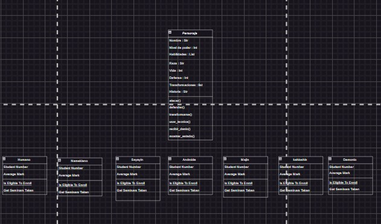

**Universidad Nacional Guillermo Brown**
**Cátedra: Estructuras de Datos en Python**
**II Cuatrimestre 2024**

# Trabajo Final Estructura de Datos


## Integrantes del Grupo
1. Florencia Molina 
3. Junior Flores
2. Matias Gonzalez 


## Tabla de Contenidos
- [Introducción](#introducción)
    - [Descripción](#descripción)
    - [Objetivos](#objetivos)
- [Planificación](#planificación)
    - [Análisis del mercado](#análisis-del-mercado)
    - [Alcance del proyecto](#alcance-del-proyecto)
    - [Metodología](#metodología)
- [Análisis](#análisis)
    - [Especificación de requerimientos](#especificación-de-requerimientos)
        - [Requerimientos funcionales](#requerimientos-funcionales)
        - [Requerimientos no funcionales](#requerimientos-no-funcionales)
    - [Historia de usuarios y criterios de aceptación](#historia-de-usuarios-y-criterios-de-aceptación)
- [Diseño](#diseño)
- [Desarrollo](#desarrollo)
    - [Clases e Interfaces](#clases-e-interfaces)
    - [Estructuras Recursivas](#estructuras-recursivas)
    - [Arboles Binarios](#arboles-binarios)
    - [Arboles Generales](#arboles-generales)
    - [Cola de Prioridades y Heap Binaria](#cola-de-prioridades-y-heap-binaria)
    - [Análisis de Algoritmos](#análisis-de-algoritmos)
    - [Grafos](#grafos)
        - [Recorridos DFS y BFS](#recorridos-DFS-y-BFS)
        - [Ordenamiento Topológico](#ordenamiento-topológico)
        - [Problemas NP y Camino Mínimo](#problemas-np-y-camino-mínimo)


- [Requisitos](#requisitos)
- [Instalación](#instalación)
- [Uso](#uso)
- [Ejemplos](#ejemplos)
- [Gráficos](#gráficos)
- [Contribuciones](#contribuciones)
- [Licencia](#licencia)

## **Introducción**

### Descripción
Este proyecto tiene como objetivo, desarrollar en grupo un juego de Dragon Ball. El propósito de este proyecto es realizar un juego para la cátedra de estructura de datos , y poder implementar todos los temas que vimos y luego realizar una defensa individual de dicho proyecto. Este trabajo tiene como carácter evaluativo con nota que sera sumada al primer parcial.
El proyecto se puede por grupos de 2 o 3 personas, utilizando el lenguaje python y librerías que sean necesarias.
Fecha de entrega 28/11 18hs.


### Objetivos
- Creación de un un juego por turnos de DBZ.
- Creación y gestión de personajes, batallas y evolución de poderes.
- Poder gestionar una forma de trabajo en grupo para la realización del proyecto.
- Entregar el trabajo en tiempo y forma.


## **Planificación**

### Análisis del mercado
[analisis-del-mercado]: #analisis-del-mercado

La relevancia de realizar este proyecto de un juego de DBZ es la de implementar todo lo aprendido en la cátedra involucrando compañeros y la búsqueda de una forma de trabajo en común para el realización del proyecto.
Poder jugar diferentes pensamientos y avanzar en grupo, divertirnos en la creación del mismo.

Publico Objetivo:
- Docente de la cátedra.
- Compañeros futuros colegas que quieran implementar mejoras.
- Publico general de video juegos.


### Alcance del proyecto
[alcence-del-proyecto]: #alcance-del-proyecto

Funciones principales
- Elegir un personaje.
- El personaje tiene que subir de niveles.
- El personaje tiene que adquirir nuevas habilidades.
- Realizar entrenamientos.
- Jugar un torneo.
- Jugar una batalla aleatoria.
- Los personajes pueden recorrer planetas del universo de dragon ball z. 
- Los personajes pueden buscar las esferas del dragon.
 
Límites del proyecto
- Crear un juego que sea por turnos.
- Crear una interfaz de usuario que sea por terminal. 


### Metodología  

Metodología y proceso de trabajo optamos en trabajar con reuniones semanales a disponibilidad de cada uno.

Tecnologías

- Visual studio code
- Python
- Meet
- Drive
- Discord
- Repositorio de Github
- Grupo de WhatsApp

**AGENDA DE REUNIONES**
Con el fin de llevar encuentros semanales para conversar acerca del trabajo final, se crearon distintas vías de comunicación entre las cuales se nombran las siguientes:
- Chat grupal en Whatsapp para facilitar la comunicación entre los integrantes.
- Drive para compartir y editar documentos.
- Canal en Discord para compartir material y llevar a cabo reuniones.
- Repositorio en GitHub para subir actividades del proyecto.
- Reuniones a través de Meet para mantener conversaciones.
A continuación se deja detallado el cronograma de encuentros a lo largo del trabajo:
**Semana 1**
Viernes 01/11/24: Se llevó a cabo el primer encuentro en Meet donde cada integrante se presentó y se delinearon las primeras ideas acerca del trabajo final. Fue en esta instancia donde se acordó crear un canal en Discord y un repositorio en GitHub para compartir material y actividades realizadas por cada integrante.
**Semana 2**
Viernes 08/11/24: Mediante una reunión de Meet se logró avanzar en las primeras unidades del trabajo. En una puesta en común, se dialogó y se brindaron opiniones sobre lo trabajado hasta el momento.
**Semana 3**
Viernes 15/11/24: Se utilizó por primera vez el canal de voz de Discord en el cual se fueron compartiendo propuestas y dificultades y, al mismo tiempo, se buscaron soluciones en conjunto para abordar dichas problemáticas. Además, se acordó seguir avanzando en las unidades siguientes.
**Semana 4**


## **Análisis**

### Especificación de requerimientos
[especificación-de-requerimientos]:#especificación-de-requerimientos


#### Requerimientos funcionales
[requerimientos-funcionales]:#requerimientos-funcionales

1. Sistema de combate:
- Implementar un sistema de combate estratégico que permita la interacción del
jugador con diferentes habilidades y movimientos desde la terminal.
- Desarrollar habilidades únicas para cada clase de personaje.

2. Progresión del Personaje:
- Crear un sistema de niveles y experiencia que permita al jugador avanzar y
mejorar a medida que avanza en el juego.
- Desarrollar un sistema de entrenamiento que permita mejorar las habilidades del personaje.
- Desarrollar un sistema que el personaje pueda viajar por diferentes planetas y poder entrenar en ellos.

3. Interacción del Jugador:
- Diseñar una interfaz de usuario desde la terminal  que permite al jugador explorar el juego y pueda participar en múltiples desafíos.


#### Requerimientos no funcionales 
[requerimientos-no-funcionales]:#requerimientos-no-funcionales

1. Rendimiento y Optimización
- Garantizar un rendimiento fluido y estable del juego, evitando errores de ejecución.

- Optimizar el uso de recursos para garantizar que el juego funcione de manera
eficiente en dispositivos de PC.

2. Estilo Visual y Narrativa:
- Desarrollar un menu intuitivo para el usuario. 
- Crear una narrativa atractiva que sumerge al jugador en el mundo del juego.

3. Estabilidad:
- Realizar pruebas para garantizar la estabilidad del juego,
minimizando errores, cierres inesperados y fallos técnicos.

### Historia de usuarios y criterios de aceptación
[historia-de-usuarios-y-criterios-de-aceptación]:(historia-de-usuarios-y-criterios-de-aceptación)

En esta sección se estudia a detalle las distintas audiencias a las que va dirigido el juego

- Docente de la cátedra : Quien nos dará una devolución critica y con nota del trabajo realizado.

- Compañeros de la clase, futuros colegas que nos darán su opinion o podrán mejorar el proyecto aportando sus propias ideas. 

- Jugadores RPG tradicionales: Personas que disfrutan de la profundidad narrativa y el
progreso de los personajes, aspectos típicamente asociados con los RPG clásicos.

- Público general de videojuegos: Este segmento, aunque amplio, puede ser atraído por una
narrativa atractiva, mecánicas de juego interesantes y un estilo visual único.


## **Diseño**

- **Herramientas y entorno de desarrollo**
    - Visual studio code
    - Git
    - Github

- **Mecánica y dinámica del juego**

    - Sistema de habilidades, los personajes utilizan habilidades exclusivos de las diferentes clases de personajes. Estas clases están representadas en una lista de habilidades.

    - Sistema de combate, los jugadores pueden utilizar ataques normales, o ataques especiales (habilidades), o cargar energía (ki) para la utilización de estas habilidades.
    El sistema esta diseñado para que sea un combate por turnos hasta que algún jugador se quede sin vida. Por cada turno se actualiza la vida, energía(ki), experiencia, nivel de los personajes.

    - Progresión del personaje, el protagonista avanza de nivel por medio de la experiencia(combates, entrenamientos), y va adquiriendo nuevas habilidades.

    - Una variedad de personajes están disponibles en el juego para elección del usuario. Estas clases ya están predefinidas en la interfaz permitiendo al usuario empezar el juego rápidamente.

    - Exploración y misiones el personaje puede explorar distintos planetas y realizar entrenamientos o misiones.

- **Arquitectura general de la aplicación**


- Diseño gráfico e interfaces.
- SDD.


## **Desarrollo**

### Clases e Interfaces
[Clases-e-Interfaces]:(#clases-e-interfaces)

**clase Personaje** con varios atributos:
- **nombre**: Nombre del personaje.
- **vida**: Puntos de vida del personaje.
- **raza**: Raza del personaje (ej. humano, sayayin).
- **estado**: Estado actual del personaje (ej. normal).
- **velocidad**: Velocidad del personaje en combate.
- **defensa**: Capacidad de defensa del personaje.
- **fuerza**: Potencia de ataque del personaje.
- **ki**: Energía actual del personaje.
- **max_ki**: Máximo nivel de ki que puede alcanzar.
- **transformaciones**: Posibles transformaciones que puede realizar el personaje.
- **habilidades**: Habilidades especiales que posee.
- **exp**: Experiencia acumulada por el personaje.
- **max_exp**: Máximo de experiencia necesaria para subir de nivel.
- **nivel_pelea**: Nivel de combate del personaje para equilibrar enfrentamientos.

**metodos**
- **mostrar_stats**: Este método imprime en consola las estadísticas actuales del personaje, mostrando todos los atributos definidos en el constructor.

- **atacar**: Este método permite al personaje atacar a otro personaje (enemigo). 
    La lógica es la siguiente:
        - Verifica si el ki es suficiente (mínimo 100).
        - Calcula el daño basado en la fuerza del personaje.
        - Determina el daño efectivo restando la defensa del enemigo.
        - Llama al método recibir_daño del enemigo para aplicar el daño.
        - Si no hay suficiente ki, imprime un mensaje recomendando cargar energía.

- **cargar_ki**: Este método permite al personaje cargar su ki hasta alcanzar su máximo. Incrementa el ki en una cantidad definida (incremento) y muestra el progreso en la consola. Utiliza un bucle while para seguir cargando hasta alcanzar max_ki.

- **defender**: 

- **usar_tecnica**:

- **recibir_daño**: Este método maneja la lógica cuando un personaje recibe daño. Si el daño recibido es menor o igual a la defensa del personaje, no se recibe daño. De lo contrario, se resta el daño a los puntos de vida y se imprime la vida restante.


### Estructuras Recursivas
[estructuras-recursivas]:(#estructuras-recursivas)

**Concepto del Algoritmo**
Experiencia: Cada vez que un personaje gana una pelea, acumula experiencia. Al alcanzar un umbral de experiencia, puede subir de nivel.
- Nivel: El nivel del personaje determina su máximo de Ki y puede influir en el multiplicador de poder.
- Máximo Ki: El máximo de Ki aumenta con cada nivel, lo que permite al personaje realizar más ataques especiales o cargar Ki más rápidamente.
**Estructura del Algoritmo**
- Clase Personaje: Contendrá atributos como nombre, fuerza base, experiencia, nivel y máximo de Ki.
- Método evolucionar_poder: Este método será recursivo y calculará el nuevo poder del personaje basado en la experiencia ganada tras cada combate.
Método para subir de nivel: Se activará cuando la experiencia acumulada alcance el máximo permitido para el nivel actual


### Arboles Binarios
[arboles-binarios]:(#arboles-binarios)


### Arboles Generales
[arboles-generales]:(#arboles-generales)


### Cola de Prioridades y Heap Binaria
[cola-de-prioridades-y-heap-binaria]:(#cola-de-prioridades-y-heap-binaria)


### Análisis de Algoritmos
[análisis-de-algoritmos]:(#análisis-de-algoritmos)

### Grafos


#### Recorridos DFS y BFS
[recorridos-DFS-y-BFS]:(#recorridos-DFS-y-BFS)

#### Ordenamiento Topológico
[ordenamiento-topológico]:(#ordenamiento-topológico)

#### Problemas NP y Camino Mínimo
[problemas-np-y-camino-mínimo]:(#problemas-np-y-camino-mínimo)


## Requisitos
Asegúrate de tener instalados los siguientes programas y bibliotecas:

- Lenguaje de programación: [Ejemplo: Python 3.8]
- Bibliotecas: 
    - 
    - 
    - Otras dependencias necesarias

## Instalación


| Columna 1 | Columna 2 |
|-----------|-----------|
| Dato 1    | Dato 2    |
| Dato 3    | Dato 4    |


Sigue estos pasos para instalar el proyecto en tu máquina local:

1. Clona el repositorio:
   ```bash
   git clone https://github.com/usuario/proyecto.git

